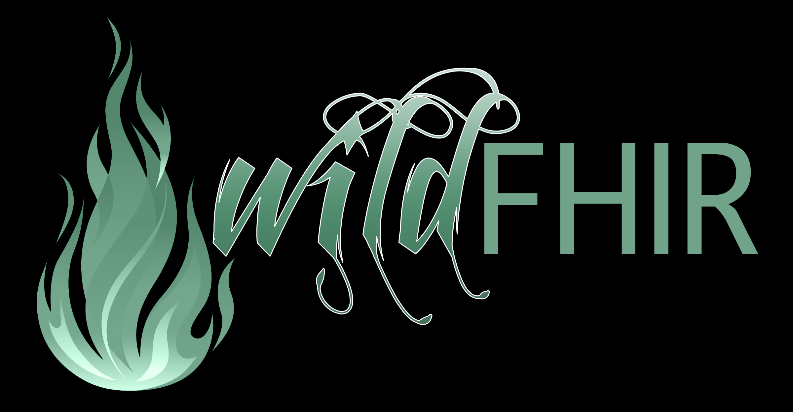

WildFHIR Community Edition
==========================

AEGIS WildFHIR - an open-source implementation of the FHIR R4 specification in Java. 

This project is Open Source, licensed under the Apache Software License 2.0.

[![License][Badge-License]][Link-License]

## CI/CD

Coming soon

## Documentation and wiki

Complete project documentation is available on our [Wiki][link-docs].

A demonstration of this project is available here: [wildfhir.aegis.net/r4]( https://wildfhir.aegis.net/r4)

Please see [this wiki page][Link-wiki] for information on where to get help with WildFHIR.

Contact our team [here][Link-support] for information on commercial support.

[link-docs]: https://github.com/AEGISnetInc/WildFHIR/wiki/Docs
[Link-wiki]: https://github.com/AEGISnetInc/WildFHIR/wiki/Getting-Help
[Link-support]: https://touchstone.com/fhir-faster/
[Link-License]: https://www.apache.org/licenses/LICENSE-2.0
[Badge-License]: https://img.shields.io/badge/license-apache%202.0-60C060.svg
