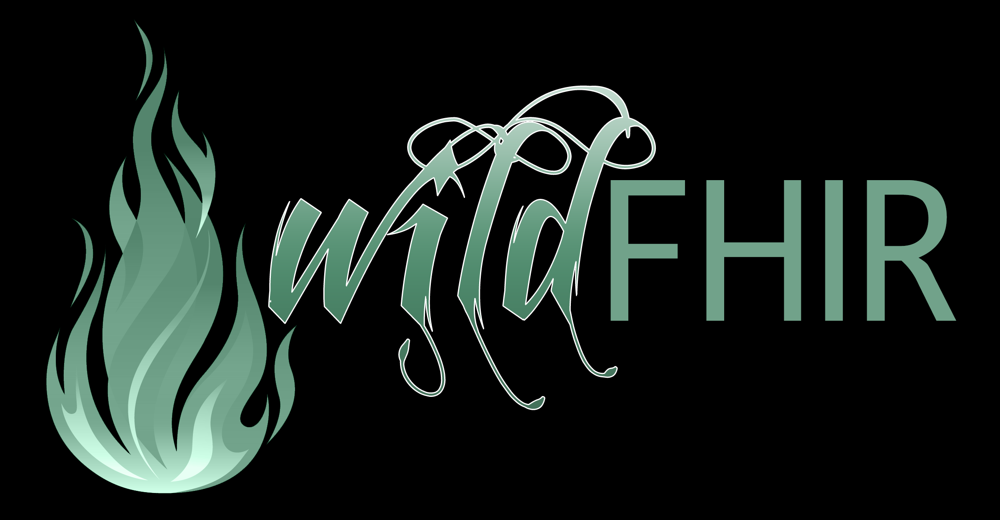
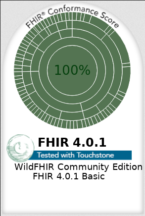

WildFHIR Community Edition
==========================

AEGIS WildFHIR - an open-source implementation of the FHIR R4 (v4.0.1 Official) specification in Java. 

This project is Open Source, licensed under the Apache Software License 2.0.

[![License][Badge-License]][Link-License]

## CI/CD

### [Touchstone Testing Results for 0.6.0](https://touchstone.aegis.net/touchstone/conformance/detail?suite=FHIR4-0-1-Basic-Server&supportedOnly=false&sVersion=38&testSystem=663543e06ee10f32b53012de&published=true&format=ALL&cb=%2FFHIR4-0-1-Standard-Server)

## Containerized Version of WildFHIR

Docker images may be found here:

[WildFHIR Community Edition - Wildfly Project](https://hub.docker.com/r/aegisnetinc/wildfhirce-wildfly)

[WildFHIR Community Edition - MySQL Project](https://hub.docker.com/r/aegisnetinc/wildfhirce-mysql)

## Documentation and wiki

Complete project documentation is available on our [Wiki][link-docs].

The WildFHIR CE R4 Implementation Guide v0.6.0 is available here: [wildfhir.wildfhir.org/ig/wildfhirce](https://wildfhir.wildfhir.org/ig/wildfhirce)

A demonstration of this project is available here: [wildfhir.wildfhir.org/r4](https://wildfhir.wildfhir.org/r4)

Please see [this wiki page][Link-wiki] for information on where to get help with WildFHIR CE.

Contact our team [here][Link-support] for information on commercial support.

[link-docs]: https://github.com/AEGISnetInc/WildFHIR/wiki/Docs
[Link-wiki]: https://github.com/AEGISnetInc/WildFHIR/wiki/Getting-Help
[Link-support]: https://touchstone.com/fhir-faster/
[Link-License]: https://www.apache.org/licenses/LICENSE-2.0
[Badge-License]: https://img.shields.io/badge/license-apache%202.0-60C060.svg
